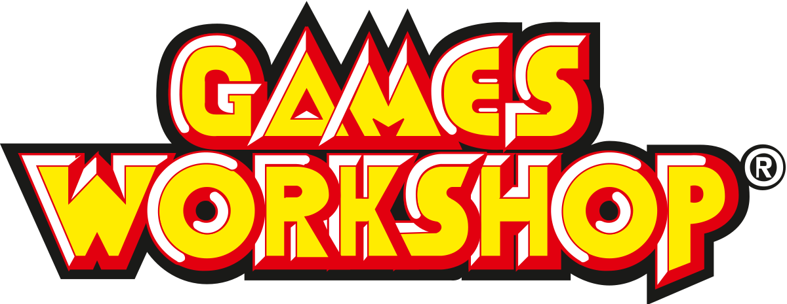

  #  

## Clone de la page d'accueil du site games-workshop.
## Technos : 

## Description: 
Intégration de la page principal de gamesworkshop.

## URL : 

> https://www.games-workshop.com/fr-FR/D-accueil

### Lancer le webpack pour utiliser les modules CommonJS :
`npm run start`
